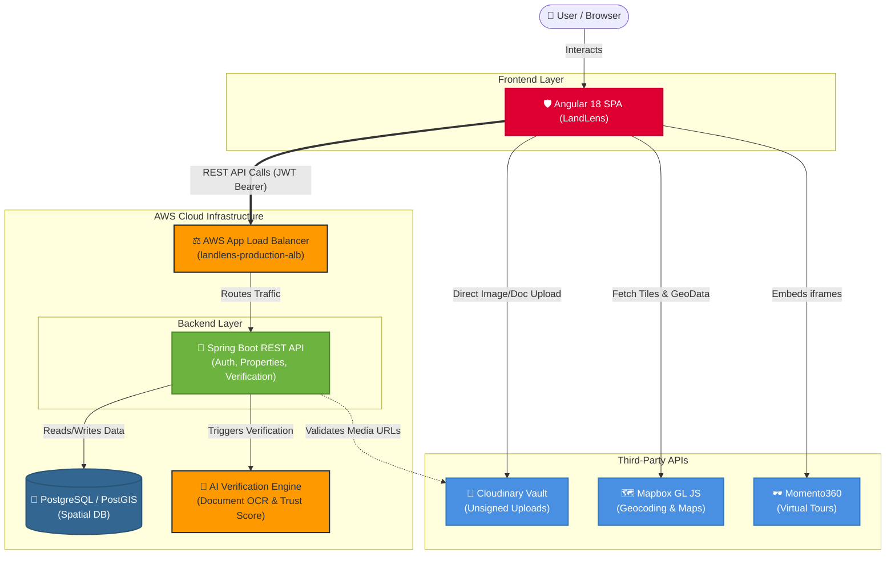

# LandLens Angular Frontend (Angular 18+)

LandLens is a secure single-page Angular application for verified land registries. It integrates automated AI Trust scoring, document OCR name matches, interactive Mapbox layouts (point selection, geocoding, clustering), and Momento360 virtual tour embeds.

---

## 🚀 Features & Architecture

The application implements a clean, modular structure with Role-Based Access Control:

*   **🔒 Auth & Guard Module**: Supports role protection (`BUYER`, `PROVIDER`, `GOVERNMENT_OFFICER`, `ADMIN`) using JWT token auth, functional interceptors for Bearer headers, and automatic token refresh queueing.
*   **🗺️ Interactive Mapping (Mapbox)**:
    *   *Buyer search*: Clusters properties in high-density regions (like Guntur, AP) and color-codes markers (Emerald = APPROVED, Amber = PENDING, Red = DISPUTED).
    *   *Provider listing*: Interactive coordinate picking with draggable marker and auto reverse-geocoding (village, district, pincode).
*   **📸 360° Virtual Tour Viewer**: Embedded iframe viewer supporting Momento360 and Kuula URLs with grace-fallback to external tabs.
*   **📁 Cloudinary Vault Uploader**: Unsigned client-side uploads of deeds and media directly to Cloudinary.
*   **🤖 AI Chat Assistant**: Dedicated chatbot module connecting to backend AI conversations.
*   **💼 Dashboards**: Custom role-tailored dashboards.

---

## 🌐 Interactive Architecture Flow

Below is the interactive visual representation of how the LandLens frontend integrates with our third-party services and AWS-hosted backend. *(Hover over nodes or pan/zoom in supported markdown viewers)*



---

## 🚀 Recent Updates & Fixes
*   **Security & Data Integrity**: 
    * Implemented strict provider-level property filtering in the Provider Dashboard to prevent 401 Unauthorized exceptions during cross-account edits.
    * Patched XSS sanitization warnings in the `PanoramaViewerComponent` by explicitly extracting safe source URLs from `<iframe>` embeds before view binding.
*   **Performance & Stability**:
    * Resolved critical Circular Dependency injections (DI) inside `AuthService` logic during initialization.
    * Added global polyfills for `window.__async` to prevent Mapbox WebWorker compiler crashes.

---

## 🛠️ Installation & Setup

### 1. Prerequisites
Ensure you have Node.js (v18+) and npm installed:
```bash
node -v
npm -v
```

### 2. Install Dependencies
Run npm install in the project root:
```bash
npm install
```

### 3. Environment Configuration
Navigate to `src/environments/environment.ts` and update the placeholder configurations:
```typescript
export const environment = {
  production: false,
  apiBaseUrl: 'http://landlens-production-alb-1919392235.ap-south-1.elb.amazonaws.com',
  mapbox: {
    accessToken: 'YOUR_MAPBOX_PUBLIC_ACCESS_TOKEN', // pk.eyJ1Ijoi...
    style: 'mapbox://styles/mapbox/streets-v12'
  },
  cloudinary: {
    cloudName: 'YOUR_CLOUDINARY_CLOUD_NAME',
    uploadPreset: 'YOUR_UNSIGNED_UPLOAD_PRESET' // Must be unsigned!
  }
};
```

---

## 🖥️ Local Development

To run the application locally on a development server:
```bash
npm run start
```
Access the application at `http://localhost:4200/`.

---

## 📦 Production Builds & Deployment

### Build Bundle
Generate optimized production bundles:
```bash
npm run build
```
The output will be created inside the `dist/` directory.

### Deploying to Netlify/Vercel
For single-page apps (SPA), make sure to configure a rewrite rule redirecting all requests to `index.html` to avoid 404 errors on route reloads.

#### Netlify config (`_redirects` in output folder):
```text
/*    /index.html   200
```

#### Vercel config (`vercel.json` in root folder):
```json
{
  "rewrites": [{ "source": "/(.*)", "destination": "/index.html" }]
}
```
