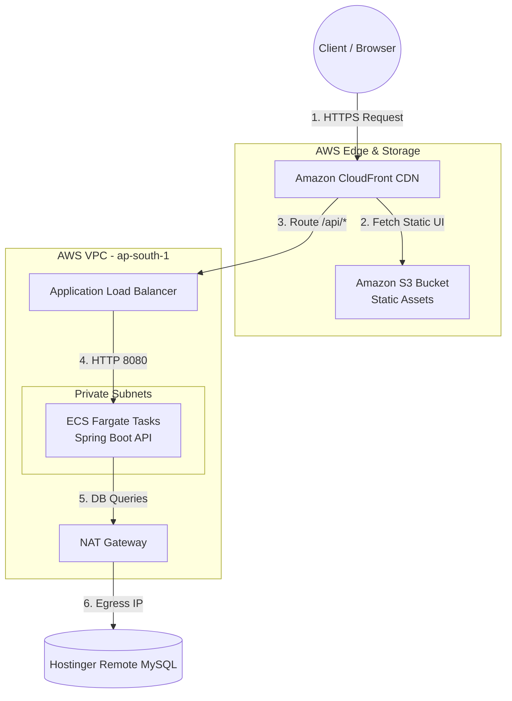
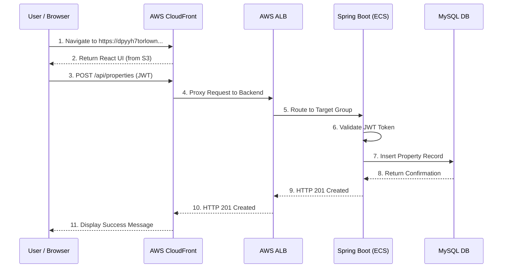
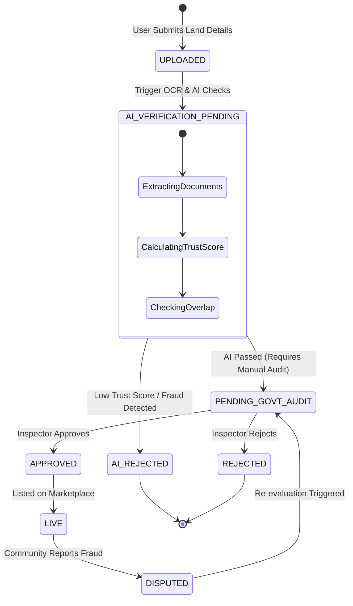

# LandLens 🌍🔍

An AI-powered government land verification portal designed to prevent real estate fraud, overlap claims, and forgery using AI trust scores, OCR verification, and 360° virtual tours.


## 🚀 Features

- **Role-Based Dashboards**: Secure, distinct portals for Buyers, Providers, Government Officers, and Admins.
- **AI Trust Scores**: Automated validation of land documents (OCR) mapping to survey numbers to calculate forgery and overlap risk.
- **Interactive Maps**: Full Mapbox GL JS integration with boundary drawing, clustering, and local survey data overlays.
- **360° Virtual Tours**: Built-in immersive panorama viewer to inspect lands remotely without physical visits.
- **Glassmorphism UI**: Stunning, modern, responsive UI built with Tailwind CSS.

## 🛠️ Tech Stack

- **Frontend Framework**: React 18
- **Build Tool**: Vite
- **Language**: TypeScript
- **Styling**: Tailwind CSS (v4 via PostCSS)
- **Icons**: Lucide React
- **Routing**: React Router DOM (v6)
- **HTTP Client**: Axios (with JWT Interceptors)
- **Mapping**: Mapbox GL JS

## ⚙️ Local Setup

1. **Clone the repository**
   ```bash
   git clone https://github.com/pirates27/frontend.git
   cd frontend
   ```

2. **Install dependencies**
   ```bash
   npm install
   ```

3. **Environment Configuration**
   Create a `.env` file in the root directory and add the following keys:
   ```env
   VITE_API_URL=http://localhost:5000/api
   VITE_MAPBOX_TOKEN=your_mapbox_public_token
   VITE_CLOUDINARY_CLOUD_NAME=your_cloudinary_name
   VITE_CLOUDINARY_UPLOAD_PRESET=your_upload_preset
   ```
   *(Note: The `.env` file is git-ignored to protect your secrets.)*

4. **Run the development server**
   ```bash
   npm run dev
   ```
   The app will be available at `http://localhost:5173`.

## 📜 Project Structure
- `/src/components/shared`: Reusable UI components (Map, VerificationBadge, PanoramaViewer)
- `/src/pages`: Feature pages (Auth, Dashboards, PropertyDetail)
- `/src/services`: API connectors and Axios interceptor logic
- `/src/models`: TypeScript interfaces for the domain models
- `/src/components/guards`: Route protection logic (Guest/Protected/Redirect)

## 🤝 Contributing
Please ensure all pull requests pass TypeScript compilation (`npm run build`) before submitting.

---

## ☁️ AWS Integration & Deployment Architecture

LandLens uses a highly available, decoupled AWS architecture. The frontend is served globally via CloudFront CDN, while API requests are securely proxied to the backend running in private subnets on ECS Fargate.



### Deployment Workflows

1. **Frontend Deployment**: 
   - Managed via GitHub Actions (`.github/workflows/deploy.yml`) or AWS CLI.
   - On push to `main`, the React app is built using `vite build`.
   - The `dist/` output is synced to the S3 bucket (`landlens-frontend-256845883985`) using `aws s3 sync`.
   - A CloudFront invalidation is triggered to serve the latest assets immediately.
   
2. **Backend Deployment**:
   - Managed via PowerShell/Bash scripts (`deploy.ps1`).
   - The Spring Boot app is compiled into a `.jar` file.
   - A Docker image is built and pushed to Amazon Elastic Container Registry (ECR).
   - The ECS Fargate service is updated to force a rolling deployment of the new container image behind the ALB.

---

## 🔄 System Flow & State Diagrams

### API Request Flow Diagram
How the frontend communicates with the backend APIs via CloudFront proxy.



### Property Verification State Machine
This diagram illustrates the lifecycle of a property listing as it goes through the AI and Government verification workflow.



---
*Built as part of a modernization migration from Angular to React + Vite. The migration is fully complete, porting all dashboards, UI elements, and API integrations with exact fidelity.*
