# LandLens Database Design Document

This document outlines a production-ready, 3NF-compliant relational database schema for **LandLens**, an AI-powered Land Verification Platform. The design is structured to integrate seamlessly with Spring Boot (JPA/Hibernate) using PostgreSQL as the target database.

## 1. Module Overview

LandLens is designed around modular boundaries to keep components decoupled, maintainable, and aligned with standard Spring Boot packages.

### Authentication & Access Control (RBAC) Module
*   **Purpose**: Manages system users, Role-Based Access Control, security logs, and token sessions.
*   **Key Capabilities**: Handles login history tracking, active refresh tokens for JWT validation, and user profile management.

### Property Listing & Asset Management Module
*   **Purpose**: Manages property details, cataloging, spatial attributes, ownership, and structural data.
*   **Key Capabilities**: Stores coordinates (Latitude/Longitude), address components (village, district, state, pincode), and general metadata.

### Property Media Module
*   **Purpose**: Manages public-facing display media associated with properties.
*   **Key Capabilities**: Stores image and video attachments, including thumbnails, aspect duration, and custom presentation sorting/ordering.

### Verification Documents Module
*   **Purpose**: Stores official registry documents uploaded by property owners for verification.
*   **Key Capabilities**: Categorizes documents (e.g., Sale Deed, Patta, Tax Receipts), tracks OCR extraction state, and maintains verification flags.

### Verification (AI & Government) Module
*   **Purpose**: Evaluates and tracks property validity, verification decisions, and history.
*   **Key Capabilities**: 
    *   **AI Verification**: Captures AI-generated reports on duplicate/fraud detection, trust scores, and document analysis.
    *   **Government Verification**: Captures manual inspector decisions, remarks, and audit trails.
    *   **Verification Timeline**: Tracks historical state changes of property lifecycles for auditing.

### Fraud & Disputes Module
*   **Purpose**: Manages claims of duplicate uploads or community-reported fraudulent listings.
*   **Key Capabilities**: Supports matching overlapping property bounds (duplicates) and reporting fraud reports assigned to officers.

### Buyer Interaction Module
*   **Purpose**: Facilitates property discovery, scheduling, and bookmarking.
*   **Key Capabilities**: Stores bookmarked lists and scheduled on-site property visits between buyers and providers.

### Notifications & Communication Module
*   **Purpose**: Handles real-time system alerts and interactive user chat history.
*   **Key Capabilities**: Stores read/unread notifications, interactive AI chat sessions, and message contexts.

### Developer API Module
*   **Purpose**: Handles security, auditing, rate limits, and analytics for external APIs exposed to developers.
*   **Key Capabilities**: Manages SHA-256 salted hashes of API keys, tracks per-key daily usage rollups, logs detailed HTTP request metadata, and regulates windowed rate limits.

### Analytics Module
*   **Purpose**: Stores daily performance statistics and engagement aggregates.
*   **Key Capabilities**: Houses pre-calculated daily metrics for admin-facing dashboards (views, searches, verifications, fraud flags, API logs).

---

## 2. Table List

All tables in the schema use PostgreSQL UUIDv4 as primary keys and include audit and activity tracking fields.

| Module | Table Name | Description |
| :--- | :--- | :--- |
| **Auth & User** | `roles` | Roles mapping to RBAC privileges. |
| | `users` | User profile, role reference, credentials. |
| | `refresh_tokens` | Active JWT refresh tokens. |
| | `login_histories` | Auditing log of user login sessions. |
| **Property** | `properties` | Core property listings and ownership details. |
| **Media** | `property_images` | Image URLs, thumbnails, and custom displays. |
| | `property_videos` | Video paths, duration, and thumbnail images. |
| **Documents** | `property_documents` | Property verification documents and OCR status. |
| **Verification** | `ai_verifications` | AI-driven Trust, Forgery, and Duplicate reports. |
| | `government_verifications` | Official government verification remarks and status. |
| | `verification_timelines` | Historic log of all verification events. |
| **Fraud & Duplicate**| `duplicate_claims` | AI-flagged duplicate submissions for overlapping properties. |
| | `fraud_reports` | Public or officer reported fraud details. |
| **Interactions** | `property_visits` | Scheduled viewings by buyers. |
| | `saved_properties` | Bookmarked listings for prospective buyers. |
| **Notifications & Chat**| `notifications` | Read/unread alerts for users. |
| | `ai_conversations` | Conversation threads with AI chat. |
| | `ai_messages` | Individual messages within an AI conversation. |
| **Developer API** | `api_keys` | Hashed authentication keys for developers. |
| | `api_usages` | Daily rolled up API access quotas. |
| | `api_logs` | Trace log of developer API requests. |
| | `api_rate_limits` | Current rate limiting windows for active keys. |
| **Analytics** | `daily_analytics` | Pre-aggregated system metrics per day. |

---

## 3. Table Details

### Common Audit Fields (Present in EVERY Table)
To enforce standard compliance, every table in the schema includes the following auditing columns:
*   `id` (`UUID`, Primary Key, Defaults to `gen_random_uuid()`)
*   `created_at` (`TIMESTAMP WITH TIME ZONE`, Not Null, Defaults to `CURRENT_TIMESTAMP`)
*   `updated_at` (`TIMESTAMP WITH TIME ZONE`, Not Null, Defaults to `CURRENT_TIMESTAMP`)
*   `created_by` (`UUID`, Nullable, Foreign Key referencing `users(id)`)
*   `updated_by` (`UUID`, Nullable, Foreign Key referencing `users(id)`)
*   `is_active` (`BOOLEAN`, Not Null, Defaults to `true` for soft-deletion support)

---

### Authentication & User Module Tables

#### `roles`
*   **Purpose**: Stores roles for user authorization.
*   **Columns**:
    *   `id` (`UUID`, PK)
    *   `name` (`VARCHAR(50)`, Not Null, Unique) - ENUM mapping: `ADMIN`, `GOVERNMENT_OFFICER`, `PROVIDER`, `BUYER`
    *   `description` (`VARCHAR(255)`)
    *   *Standard Audit Columns*
*   **Indexes**: Unique index on `name`.
*   **Unique Constraints**: `name`

#### `users`
*   **Purpose**: Holds credential hash, profile information, and role association.
*   **Columns**:
    *   `id` (`UUID`, PK)
    *   `email` (`VARCHAR(150)`, Not Null, Unique)
    *   `password_hash` (`VARCHAR(255)`, Not Null)
    *   `first_name` (`VARCHAR(100)`, Not Null)
    *   `last_name` (`VARCHAR(100)`, Not Null)
    *   `phone_number` (`VARCHAR(20)`)
    *   `role_id` (`UUID`, Not Null, FK referencing `roles(id)`)
    *   *Standard Audit Columns*
*   **Indexes**: Unique index on `email`, Index on `role_id`.
*   **Unique Constraints**: `email`

#### `refresh_tokens`
*   **Purpose**: Tracks and manages JWT refresh tokens for persistent login.
*   **Columns**:
    *   `id` (`UUID`, PK)
    *   `user_id` (`UUID`, Not Null, FK referencing `users(id)`)
    *   `token` (`VARCHAR(512)`, Not Null, Unique)
    *   `expiry_date` (`TIMESTAMP WITH TIME ZONE`, Not Null)
    *   `revoked` (`BOOLEAN`, Not Null, Default `false`)
    *   *Standard Audit Columns*
*   **Indexes**: Unique index on `token`, Index on `user_id`.
*   **Unique Constraints**: `token`

#### `login_histories`
*   **Purpose**: Logs successful/failed login events for security auditing.
*   **Columns**:
    *   `id` (`UUID`, PK)
    *   `user_id` (`UUID`, Not Null, FK referencing `users(id)`)
    *   `login_timestamp` (`TIMESTAMP WITH TIME ZONE`, Not Null, Default `CURRENT_TIMESTAMP`)
    *   `ip_address` (`VARCHAR(45)`, Not Null) - Supports IPv4 and IPv6
    *   `user_agent` (`VARCHAR(512)`)
    *   `status` (`VARCHAR(20)`, Not Null) - Check Constraint: `SUCCESS`, `FAILED`
    *   *Standard Audit Columns*
*   **Indexes**: Index on `user_id`, Index on `login_timestamp`.

---

### Property Module Tables

#### `properties`
*   **Purpose**: The central entity representing a plot of land or real estate.
*   **Columns**:
    *   `id` (`UUID`, PK)
    *   `property_code` (`VARCHAR(50)`, Not Null, Unique) - System-generated reference
    *   `title` (`VARCHAR(150)`, Not Null)
    *   `category` (`VARCHAR(50)`, Not Null) - Check Constraint: `RESIDENTIAL`, `COMMERCIAL`, `AGRICULTURAL`, `INDUSTRIAL`
    *   `area` (`NUMERIC(12, 2)`, Not Null) - Expressed in square units (e.g. sq ft/sq m)
    *   `price` (`NUMERIC(15, 2)`, Not Null)
    *   `description` (`TEXT`)
    *   `survey_number` (`VARCHAR(50)`, Not Null)
    *   `address` (`VARCHAR(255)`, Not Null)
    *   `latitude` (`NUMERIC(9, 6)`, Not Null)
    *   `longitude` (`NUMERIC(9, 6)`, Not Null)
    *   `district` (`VARCHAR(100)`, Not Null)
    *   `village` (`VARCHAR(100)`, Not Null)
    *   `state` (`VARCHAR(100)`, Not Null)
    *   `pincode` (`VARCHAR(10)`, Not Null)
    *   `three_sixty_image_url` (`VARCHAR(512)`) - Optional URL of 360-degree image to render interactive panoramic view
    *   `status` (`VARCHAR(30)`, Not Null) - Check Constraint: `PENDING_AI`, `PENDING_GOVT`, `APPROVED`, `REJECTED`, `DISPUTED`
    *   `provider_id` (`UUID`, Not Null, FK referencing `users(id)`)
    *   *Standard Audit Columns*
*   **Indexes**: 
    *   Unique index on `property_code`.
    *   Index on `provider_id`.
    *   Index on `status`.
    *   Index on `district`, `village`, `state` (for location filtering).
    *   Index on (`latitude`, `longitude`) (for spatial lookups).
*   **Unique Constraints**: `property_code`

---

### Property Media Module Tables

#### `property_images`
*   **Purpose**: Image files associated with a property listing.
*   **Columns**:
    *   `id` (`UUID`, PK)
    *   `property_id` (`UUID`, Not Null, FK referencing `properties(id)`)
    *   `image_url` (`VARCHAR(512)`, Not Null)
    *   `thumbnail_url` (`VARCHAR(512)`, Not Null)
    *   `display_order` (`INTEGER`, Not Null, Default `0`)
    *   *Standard Audit Columns*
*   **Indexes**: Index on `property_id`, Index on (`property_id`, `display_order`).

#### `property_videos`
*   **Purpose**: Video uploads showcasing a property listing.
*   **Columns**:
    *   `id` (`UUID`, PK)
    *   `property_id` (`UUID`, Not Null, FK referencing `properties(id)`)
    *   `video_url` (`VARCHAR(512)`, Not Null)
    *   `duration` (`INTEGER`) - Duration in seconds
    *   `thumbnail_url` (`VARCHAR(512)`)
    *   *Standard Audit Columns*
*   **Indexes**: Index on `property_id`.

---

### Property Documents Module Tables

#### `property_documents`
*   **Purpose**: Legal and regulatory documents uploaded for verification.
*   **Columns**:
    *   `id` (`UUID`, PK)
    *   `property_id` (`UUID`, Not Null, FK referencing `properties(id)`)
    *   `document_type` (`VARCHAR(50)`, Not Null) - Check Constraint: `SALE_DEED`, `PATTA`, `SURVEY_MAP`, `TAX_RECEIPT`, `IDENTITY_PROOF`, `OWNERSHIP_PROOF`
    *   `file_url` (`VARCHAR(512)`, Not Null)
    *   `ocr_status` (`VARCHAR(30)`, Not Null) - Check Constraint: `PENDING`, `PROCESSING`, `COMPLETED`, `FAILED`
    *   `verification_status` (`VARCHAR(30)`, Not Null) - Check Constraint: `UNVERIFIED`, `VERIFIED`, `REJECTED`
    *   *Standard Audit Columns*
*   **Indexes**: Index on `property_id`, Index on `document_type`.

---

### Verification Module Tables

#### `ai_verifications`
*   **Purpose**: Stores AI engine analysis. One-to-One with properties.
*   **Columns**:
    *   `id` (`UUID`, PK)
    *   `property_id` (`UUID`, Not Null, Unique, FK referencing `properties(id)`)
    *   `ai_trust_score` (`NUMERIC(5, 2)`, Not Null) - Scale: `0.00` to `100.00`
    *   `forgery_score` (`NUMERIC(5, 2)`, Not Null)
    *   `duplicate_score` (`NUMERIC(5, 2)`, Not Null)
    *   `ownership_match` (`BOOLEAN`, Not Null)
    *   `risk_score` (`NUMERIC(5, 2)`, Not Null)
    *   `summary` (`TEXT`)
    *   `confidence` (`NUMERIC(5, 2)`, Not Null)
    *   `generated_date` (`TIMESTAMP WITH TIME ZONE`, Not Null, Default `CURRENT_TIMESTAMP`)
    *   *Standard Audit Columns*
*   **Indexes**: Unique index on `property_id`.

#### `government_verifications`
*   **Purpose**: Stores official government review details. One-to-One with properties.
*   **Columns**:
    *   `id` (`UUID`, PK)
    *   `property_id` (`UUID`, Not Null, Unique, FK referencing `properties(id)`)
    *   `officer_id` (`UUID`, Not Null, FK referencing `users(id)`)
    *   `remarks` (`TEXT`)
    *   `status` (`VARCHAR(30)`, Not Null) - Check Constraint: `APPROVED`, `REJECTED`, `DISPUTED`
    *   `verified_date` (`TIMESTAMP WITH TIME ZONE`, Not Null, Default `CURRENT_TIMESTAMP`)
    *   *Standard Audit Columns*
*   **Indexes**: Unique index on `property_id`, Index on `officer_id`.

#### `verification_timelines`
*   **Purpose**: Historical event log of property status transitions for auditing.
*   **Columns**:
    *   `id` (`UUID`, PK)
    *   `property_id` (`UUID`, Not Null, FK referencing `properties(id)`)
    *   `timestamp` (`TIMESTAMP WITH TIME ZONE`, Not Null, Default `CURRENT_TIMESTAMP`)
    *   `action` (`VARCHAR(50)`, Not Null) - Check Constraint: `UPLOADED`, `AI_STARTED`, `AI_COMPLETED`, `GOVT_REVIEW_STARTED`, `APPROVED`, `REJECTED`, `DISPUTED`
    *   `remarks` (`TEXT`)
    *   `user_id` (`UUID`, Not Null, FK referencing `users(id)`)
    *   *Standard Audit Columns*
*   **Indexes**: Index on `property_id`, Index on `timestamp`.

---

### Fraud & Disputes Module Tables

#### `duplicate_claims`
*   **Purpose**: Tracks duplicate property uploads flagged by the AI engine.
*   **Columns**:
    *   `id` (`UUID`, PK)
    *   `property_a_id` (`UUID`, Not Null, FK referencing `properties(id)`)
    *   `property_b_id` (`UUID`, Not Null, FK referencing `properties(id)`)
    *   `similarity` (`NUMERIC(5, 2)`, Not Null) - Overlap percentage (e.g. coordinates or OCR contents)
    *   `reason` (`TEXT`, Not Null)
    *   `status` (`VARCHAR(30)`, Not Null) - Check Constraint: `FLAGGED`, `INVESTIGATING`, `RESOLVED`, `FALSE_POSITIVE`
    *   `decision` (`VARCHAR(50)`) - Check Constraint: `MERGED`, `CANCELLED_A`, `CANCELLED_B`, `NO_ACTION`
    *   *Standard Audit Columns*
*   **Indexes**: 
    *   Index on `property_a_id`, Index on `property_b_id`.
    *   Unique constraint index on (`property_a_id`, `property_b_id`) or sorted pair validation.

#### `fraud_reports`
*   **Purpose**: Handles complaints, flags, or disputes raised by users.
*   **Columns**:
    *   `id` (`UUID`, PK)
    *   `reporter_id` (`UUID`, Not Null, FK referencing `users(id)`)
    *   `property_id` (`UUID`, Not Null, FK referencing `properties(id)`)
    *   `reason` (`VARCHAR(150)`, Not Null)
    *   `description` (`TEXT`, Not Null)
    *   `status` (`VARCHAR(30)`, Not Null) - Check Constraint: `SUBMITTED`, `UNDER_INVESTIGATION`, `RESOLVED_FRAUD`, `RESOLVED_DISMISSED`
    *   `officer_id` (`UUID`, FK referencing `users(id)`) - Assigned investigating officer
    *   *Standard Audit Columns*
*   **Indexes**: Index on `property_id`, Index on `reporter_id`, Index on `status`.

---

### Buyer Interaction Module Tables

#### `property_visits`
*   **Purpose**: Schedules physical inspections of properties by buyers.
*   **Columns**:
    *   `id` (`UUID`, PK)
    *   `buyer_id` (`UUID`, Not Null, FK referencing `users(id)`)
    *   `property_id` (`UUID`, Not Null, FK referencing `properties(id)`)
    *   `visit_date` (`DATE`, Not Null)
    *   `visit_time` (`TIME`, Not Null)
    *   `status` (`VARCHAR(30)`, Not Null) - Check Constraint: `SCHEDULED`, `COMPLETED`, `CANCELLED`, `RESCHEDULED`
    *   *Standard Audit Columns*
*   **Indexes**: Index on `buyer_id`, Index on `property_id`, Index on `visit_date`.

#### `saved_properties`
*   **Purpose**: Implements bookmarks or user watchlists.
*   **Columns**:
    *   `id` (`UUID`, PK)
    *   `buyer_id` (`UUID`, Not Null, FK referencing `users(id)`)
    *   `property_id` (`UUID`, Not Null, FK referencing `properties(id)`)
    *   *Standard Audit Columns*
*   **Indexes**: Unique index on (`buyer_id`, `property_id`), Index on `property_id`.

---

### Notifications & Communication Module Tables

#### `notifications`
*   **Purpose**: Manages system notification records delivered to users.
*   **Columns**:
    *   `id` (`UUID`, PK)
    *   `title` (`VARCHAR(150)`, Not Null)
    *   `message` (`TEXT`, Not Null)
    *   `type` (`VARCHAR(50)`, Not Null) - Check Constraint: `SYSTEM`, `PROPERTY_VERIFIED`, `VISIT_SCHEDULED`, `FRAUD_ALERT`, `API_LIMIT_REACHED`
    *   `is_read` (`BOOLEAN`, Not Null, Default `false`)
    *   `receiver_id` (`UUID`, Not Null, FK referencing `users(id)`)
    *   `created_time` (`TIMESTAMP WITH TIME ZONE`, Not Null, Default `CURRENT_TIMESTAMP`)
    *   *Standard Audit Columns*
*   **Indexes**: Index on `receiver_id`, Index on `is_read`.

#### `ai_conversations`
*   **Purpose**: Thread container for chat interactions with AI verification helper.
*   **Columns**:
    *   `id` (`UUID`, PK)
    *   `user_id` (`UUID`, Not Null, FK referencing `users(id)`)
    *   `title` (`VARCHAR(150)`)
    *   *Standard Audit Columns*
*   **Indexes**: Index on `user_id`.

#### `ai_messages`
*   **Purpose**: Individual message entries within AI chat sessions.
*   **Columns**:
    *   `id` (`UUID`, PK)
    *   `conversation_id` (`UUID`, Not Null, FK referencing `ai_conversations(id)`)
    *   `sender_role` (`VARCHAR(20)`, Not Null) - Check Constraint: `USER`, `AI`
    *   `content` (`TEXT`, Not Null)
    *   `timestamp` (`TIMESTAMP WITH TIME ZONE`, Not Null, Default `CURRENT_TIMESTAMP`)
    *   *Standard Audit Columns*
*   **Indexes**: Index on `conversation_id`, Index on `timestamp`.

---

### Developer API Module Tables

#### `api_keys`
*   **Purpose**: Manages access keys generated by developers to make authenticated API requests.
*   **Columns**:
    *   `id` (`UUID`, PK)
    *   `user_id` (`UUID`, Not Null, FK referencing `users(id)`)
    *   `key_hash` (`VARCHAR(255)`, Not Null, Unique) - Salted SHA-256 hash of API key
    *   `name` (`VARCHAR(100)`, Not Null)
    *   `prefix` (`VARCHAR(8)`, Not Null) - E.g. "ll_live_"
    *   `status` (`VARCHAR(20)`, Not Null) - Check Constraint: `ACTIVE`, `REVOKED`, `EXPIRED`
    *   `expiry_date` (`TIMESTAMP WITH TIME ZONE`)
    *   *Standard Audit Columns*
*   **Indexes**: Unique index on `key_hash`, Index on `user_id`.
*   **Unique Constraints**: `key_hash`

#### `api_usages`
*   **Purpose**: Keeps daily usage aggregations per key for billing or limits.
*   **Columns**:
    *   `id` (`UUID`, PK)
    *   `api_key_id` (`UUID`, Not Null, FK referencing `api_keys(id)`)
    *   `usage_date` (`DATE`, Not Null)
    *   `call_count` (`INTEGER`, Not Null, Default `0`)
    *   *Standard Audit Columns*
*   **Indexes**: Unique index on (`api_key_id`, `usage_date`).

#### `api_logs`
*   **Purpose**: Raw execution logs of Developer API usage.
*   **Columns**:
    *   `id` (`UUID`, PK)
    *   `api_key_id` (`UUID`, Not Null, FK referencing `api_keys(id)`)
    *   `endpoint` (`VARCHAR(255)`, Not Null)
    *   `method` (`VARCHAR(10)`, Not Null) - Check Constraint: `GET`, `POST`, `PUT`, `DELETE`
    *   `status_code` (`INTEGER`, Not Null)
    *   `ip_address` (`VARCHAR(45)`, Not Null)
    *   `request_timestamp` (`TIMESTAMP WITH TIME ZONE`, Not Null, Default `CURRENT_TIMESTAMP`)
    *   `response_time_ms` (`INTEGER`, Not Null)
    *   *Standard Audit Columns*
*   **Indexes**: Index on `api_key_id`, Index on `request_timestamp`.

#### `api_rate_limits`
*   **Purpose**: Manages sliding or fixed window state limits. One-to-One with API Key.
*   **Columns**:
    *   `id` (`UUID`, PK)
    *   `api_key_id` (`UUID`, Not Null, Unique, FK referencing `api_keys(id)`)
    *   `limit_type` (`VARCHAR(20)`, Not Null) - Check Constraint: `HOURLY`, `DAILY`
    *   `max_requests` (`INTEGER`, Not Null)
    *   `current_window_start` (`TIMESTAMP WITH TIME ZONE`, Not Null, Default `CURRENT_TIMESTAMP`)
    *   *Standard Audit Columns*
*   **Indexes**: Unique index on `api_key_id`.

---

### Analytics Module Table

#### `daily_analytics`
*   **Purpose**: Store daily pre-aggregated usage counts for platform dashboard statistics.
*   **Columns**:
    *   `id` (`UUID`, PK)
    *   `analytics_date` (`DATE`, Not Null, Unique)
    *   `property_views` (`INTEGER`, Not Null, Default `0`)
    *   `search_count` (`INTEGER`, Not Null, Default `0`)
    *   `verification_count` (`INTEGER`, Not Null, Default `0`)
    *   `fraud_count` (`INTEGER`, Not Null, Default `0`)
    *   `api_calls` (`INTEGER`, Not Null, Default `0`)
    *   *Standard Audit Columns*
*   **Indexes**: Unique index on `analytics_date`.
*   **Unique Constraints**: `analytics_date`

---

## 4. Relationships

The database is normalized to Third Normal Form (3NF) to guarantee data integrity, avoid duplicate storage, and maintain clear JPA lifecycle structures. Below is the relational mapping:

### User & Authentication
*   `roles` ──(1:N)──> `users` *(One role belongs to many users, each user has exactly one role)*
*   `users` ──(1:N)──> `refresh_tokens` *(A user can have multiple active devices/tokens)*
*   `users` ──(1:N)──> `login_histories` *(One user can log in multiple times)*

### Property & Media
*   `users` (Provider) ──(1:N)──> `properties` *(One provider owns multiple properties)*
*   `properties` ──(1:N)──> `property_images` *(One property contains multiple images)*
*   `properties` ──(1:N)──> `property_videos` *(One property contains multiple videos)*
*   `properties` ──(1:N)──> `property_documents` *(One property holds multiple legal documents)*

### Verification & AI
*   `properties` ──(1:1)──> `ai_verifications` *(One property gets exactly one AI verification report)*
*   `properties` ──(1:1)──> `government_verifications` *(One property gets exactly one government verification decision)*
*   `users` (Officer) ──(1:N)──> `government_verifications` *(One officer reviews many properties)*
*   `properties` ──(1:N)──> `verification_timelines` *(One property records multiple progress actions/states)*
*   `users` ──(1:N)──> `verification_timelines` *(One user initiates multiple actions on the timeline)*

### Fraud & Duplicates
*   `properties` (Property A) ──(1:N)──> `duplicate_claims`
*   `properties` (Property B) ──(1:N)──> `duplicate_claims` *(Duplicate claims join two distinct properties. This is a clean dual-FK 1:N structural join)*
*   `users` (Reporter) ──(1:N)──> `fraud_reports` *(A user can report multiple properties)*
*   `properties` ──(1:N)──> `fraud_reports` *(A property can receive multiple reports)*
*   `users` (Officer) ──(1:N)──> `fraud_reports` *(An officer is assigned to multiple investigations)*

### Interactions
*   `users` (Buyer) ──(1:N)──> `property_visits` *(A buyer schedules multiple visits)*
*   `properties` ──(1:N)──> `property_visits` *(A property receives multiple visits)*
*   `users` (Buyer) ──(1:N)──> `saved_properties` *(A buyer saves multiple bookmarked properties)*
*   `properties` ──(1:N)──> `saved_properties` *(A property is bookmarked by multiple buyers)*

### Notifications & AI Chat
*   `users` (Receiver) ──(1:N)──> `notifications` *(A user receives multiple notifications)*
*   `users` ──(1:N)──> `ai_conversations` *(A user initiates multiple conversation threads with the AI)*
*   `ai_conversations` ──(1:N)──> `ai_messages` *(A thread contains multiple chat messages)*

### Developer API
*   `users` ──(1:N)──> `api_keys` *(A developer user generates multiple API keys)*
*   `api_keys` ──(1:N)──> `api_usages` *(An API key records daily rollups)*
*   `api_keys` ──(1:N)──> `api_logs` *(An API key tracks detailed HTTP request entries)*
*   `api_keys` ──(1:1)──> `api_rate_limits` *(An API key has exactly one active rate limit configuration)*

---

## 5. Mermaid ER Diagram

```mermaid
erDiagram
    roles {
        UUID id PK
        VARCHAR name UK
        VARCHAR description
        TIMESTAMP created_at
        TIMESTAMP updated_at
        UUID created_by
        UUID updated_by
        BOOLEAN is_active
    }

    users {
        UUID id PK
        VARCHAR email UK
        VARCHAR password_hash
        VARCHAR first_name
        VARCHAR last_name
        VARCHAR phone_number
        UUID role_id FK
        TIMESTAMP created_at
        TIMESTAMP updated_at
        UUID created_by
        UUID updated_by
        BOOLEAN is_active
    }

    refresh_tokens {
        UUID id PK
        UUID user_id FK
        VARCHAR token UK
        TIMESTAMP expiry_date
        BOOLEAN revoked
        TIMESTAMP created_at
        TIMESTAMP updated_at
        UUID created_by
        UUID updated_by
        BOOLEAN is_active
    }

    login_histories {
        UUID id PK
        UUID user_id FK
        TIMESTAMP login_timestamp
        VARCHAR ip_address
        VARCHAR user_agent
        VARCHAR status
        TIMESTAMP created_at
        TIMESTAMP updated_at
        UUID created_by
        UUID updated_by
        BOOLEAN is_active
    }

    properties {
        UUID id PK
        VARCHAR property_code UK
        VARCHAR title
        VARCHAR category
        NUMERIC area
        NUMERIC price
        TEXT description
        VARCHAR survey_number
        VARCHAR address
        NUMERIC latitude
        NUMERIC longitude
        VARCHAR district
        VARCHAR village
        VARCHAR state
        VARCHAR pincode
        VARCHAR three_sixty_image_url
        VARCHAR status
        UUID provider_id FK
        TIMESTAMP created_at
        TIMESTAMP updated_at
        UUID created_by
        UUID updated_by
        BOOLEAN is_active
    }

    property_images {
        UUID id PK
        UUID property_id FK
        VARCHAR image_url
        VARCHAR thumbnail_url
        INTEGER display_order
        TIMESTAMP created_at
        TIMESTAMP updated_at
        UUID created_by
        UUID updated_by
        BOOLEAN is_active
    }

    property_videos {
        UUID id PK
        UUID property_id FK
        VARCHAR video_url
        INTEGER duration
        VARCHAR thumbnail_url
        TIMESTAMP created_at
        TIMESTAMP updated_at
        UUID created_by
        UUID updated_by
        BOOLEAN is_active
    }

    property_documents {
        UUID id PK
        UUID property_id FK
        VARCHAR document_type
        VARCHAR file_url
        VARCHAR ocr_status
        VARCHAR verification_status
        TIMESTAMP created_at
        TIMESTAMP updated_at
        UUID created_by
        UUID updated_by
        BOOLEAN is_active
    }

    ai_verifications {
        UUID id PK
        UUID property_id FK "Unique"
        NUMERIC ai_trust_score
        NUMERIC forgery_score
        NUMERIC duplicate_score
        BOOLEAN ownership_match
        NUMERIC risk_score
        TEXT summary
        NUMERIC confidence
        TIMESTAMP generated_date
        TIMESTAMP created_at
        TIMESTAMP updated_at
        UUID created_by
        UUID updated_by
        BOOLEAN is_active
    }

    government_verifications {
        UUID id PK
        UUID property_id FK "Unique"
        UUID officer_id FK
        TEXT remarks
        VARCHAR status
        TIMESTAMP verified_date
        TIMESTAMP created_at
        TIMESTAMP updated_at
        UUID created_by
        UUID updated_by
        BOOLEAN is_active
    }

    verification_timelines {
        UUID id PK
        UUID property_id FK
        TIMESTAMP timestamp
        VARCHAR action
        TEXT remarks
        UUID user_id FK
        TIMESTAMP created_at
        TIMESTAMP updated_at
        UUID created_by
        UUID updated_by
        BOOLEAN is_active
    }

    duplicate_claims {
        UUID id PK
        UUID property_a_id FK
        UUID property_b_id FK
        NUMERIC similarity
        TEXT reason
        VARCHAR status
        VARCHAR decision
        TIMESTAMP created_at
        TIMESTAMP updated_at
        UUID created_by
        UUID updated_by
        BOOLEAN is_active
    }

    fraud_reports {
        UUID id PK
        UUID reporter_id FK
        UUID property_id FK
        VARCHAR reason
        TEXT description
        VARCHAR status
        UUID officer_id FK
        TIMESTAMP created_at
        TIMESTAMP updated_at
        UUID created_by
        UUID updated_by
        BOOLEAN is_active
    }

    property_visits {
        UUID id PK
        UUID buyer_id FK
        UUID property_id FK
        DATE visit_date
        TIME visit_time
        VARCHAR status
        TIMESTAMP created_at
        TIMESTAMP updated_at
        UUID created_by
        UUID updated_by
        BOOLEAN is_active
    }

    saved_properties {
        UUID id PK
        UUID buyer_id FK
        UUID property_id FK
        TIMESTAMP created_at
        TIMESTAMP updated_at
        UUID created_by
        UUID updated_by
        BOOLEAN is_active
    }

    notifications {
        UUID id PK
        VARCHAR title
        TEXT message
        VARCHAR type
        BOOLEAN is_read
        UUID receiver_id FK
        TIMESTAMP created_time
        TIMESTAMP created_at
        TIMESTAMP updated_at
        UUID created_by
        UUID updated_by
        BOOLEAN is_active
    }

    ai_conversations {
        UUID id PK
        UUID user_id FK
        VARCHAR title
        TIMESTAMP created_at
        TIMESTAMP updated_at
        UUID created_by
        UUID updated_by
        BOOLEAN is_active
    }

    ai_messages {
        UUID id PK
        UUID conversation_id FK
        VARCHAR sender_role
        TEXT content
        TIMESTAMP timestamp
        TIMESTAMP created_at
        TIMESTAMP updated_at
        UUID created_by
        UUID updated_by
        BOOLEAN is_active
    }

    api_keys {
        UUID id PK
        UUID user_id FK
        VARCHAR key_hash UK
        VARCHAR name
        VARCHAR prefix
        VARCHAR status
        TIMESTAMP expiry_date
        TIMESTAMP created_at
        TIMESTAMP updated_at
        UUID created_by
        UUID updated_by
        BOOLEAN is_active
    }

    api_usages {
        UUID id PK
        UUID api_key_id FK
        DATE usage_date
        INTEGER call_count
        TIMESTAMP created_at
        TIMESTAMP updated_at
        UUID created_by
        UUID updated_by
        BOOLEAN is_active
    }

    api_logs {
        UUID id PK
        UUID api_key_id FK
        VARCHAR endpoint
        VARCHAR method
        INTEGER status_code
        VARCHAR ip_address
        TIMESTAMP request_timestamp
        INTEGER response_time_ms
        TIMESTAMP created_at
        TIMESTAMP updated_at
        UUID created_by
        UUID updated_by
        BOOLEAN is_active
    }

    api_rate_limits {
        UUID id PK
        UUID api_key_id FK "Unique"
        VARCHAR limit_type
        INTEGER max_requests
        TIMESTAMP current_window_start
        TIMESTAMP created_at
        TIMESTAMP updated_at
        UUID created_by
        UUID updated_by
        BOOLEAN is_active
    }

    daily_analytics {
        UUID id PK
        DATE analytics_date UK
        INTEGER property_views
        INTEGER search_count
        INTEGER verification_count
        INTEGER fraud_count
        INTEGER api_calls
        TIMESTAMP created_at
        TIMESTAMP updated_at
        UUID created_by
        UUID updated_by
        BOOLEAN is_active
    }

    roles ||--o{ users : "assigns"
    users ||--o{ refresh_tokens : "generates"
    users ||--o{ login_histories : "attempts"
    users ||--o{ properties : "owns"
    users ||--o{ government_verifications : "performs"
    users ||--o{ verification_timelines : "triggers"
    users ||--o{ fraud_reports : "reports"
    users ||--o{ fraud_reports : "investigates"
    users ||--o{ property_visits : "schedules"
    users ||--o{ saved_properties : "saves"
    users ||--o{ notifications : "receives"
    users ||--o{ ai_conversations : "starts"
    users ||--o{ api_keys : "creates"

    properties ||--o{ property_images : "has"
    properties ||--o{ property_videos : "has"
    properties ||--o{ property_documents : "requires"
    properties ||--|| ai_verifications : "analyzed"
    properties ||--|| government_verifications : "assessed"
    properties ||--o{ verification_timelines : "logs"
    properties ||--o{ duplicate_claims : "acts-as-A"
    properties ||--o{ duplicate_claims : "acts-as-B"
    properties ||--o{ fraud_reports : "accused-in"
    properties ||--o{ property_visits : "hosts"
    properties ||--o{ saved_properties : "saved-in"

    ai_conversations ||--o{ ai_messages : "contains"
    api_keys ||--o{ api_usages : "tracks"
    api_keys ||--o{ api_logs : "records"
    api_keys ||--|| api_rate_limits : "restricts"
```



---

## 6. Suggested Spring Boot Packages

To support a clean, modular Spring Boot service architecture, structure the codebase with the following package layout:

```
com.landlens
 ├── auth
 │    ├── controller
 │    ├── service
 │    ├── model (Role, RefreshToken, LoginHistory)
 │    ├── repository
 │    └── security (JWT filter, WebSecurityConfig)
 ├── user
 │    ├── controller
 │    ├── service
 │    ├── model (User)
 │    └── repository
 ├── property
 │    ├── controller
 │    ├── service
 │    ├── model (Property, PropertyImage, PropertyVideo, SavedProperty, PropertyVisit)
 │    └── repository
 ├── document
 │    ├── controller
 │    ├── service
 │    ├── model (PropertyDocument)
 │    └── repository
 ├── verification
 │    ├── controller
 │    ├── service
 │    ├── model (GovernmentVerification, VerificationTimeline)
 │    └── repository
 ├── ai
 │    ├── controller
 │    ├── service (AI analysis and chat connection)
 │    ├── model (AiVerification, AiConversation, AiMessage)
 │    └── repository
 ├── api
 │    ├── controller
 │    ├── service (Rate limiting and developer usage tracking)
 │    ├── model (ApiKey, ApiUsage, ApiLog, ApiRateLimit)
 │    ├── repository
 │    └── interceptor (Rate limit / API key validation)
 └── analytics
      ├── controller
      ├── service (Daily aggregates scheduler)
      ├── model (DailyAnalytics)
      └── repository
```

---

## 7. Development Order

To guarantee minimal rework and clear, dependency-free development, implement the modules in the following order:

1.  **Authentication & User Module (`com.landlens.auth`, `com.landlens.user`)**
    *   *Why first*: User roles and authentication form the security context and provide the primary foreign keys (`created_by`, `updated_by`) for all other tables.
2.  **Property Module (`com.landlens.property`)**
    *   *Why next*: The fundamental core of the platform is the Property entity. No media, documents, or verifications can be added without it.
3.  **Property Media & Documents (`com.landlens.document`)**
    *   *Why*: Attaches images, videos, and legal documents (e.g. Patta, deeds) directly to properties. Allows uploading assets needed for verification.
4.  **AI Verification (`com.landlens.ai`)**
    *   *Why*: Once a property and its documents are loaded, the AI system runs its OCR and trust-evaluation engine, producing scores and chat assistance context.
5.  **Government Verification & Timeline (`com.landlens.verification`)**
    *   *Why*: Officers inspect AI verification scores and documents to render a final manual decision, updating the property verification timeline.
6.  **Interactions (Visits, Bookmarks) & Notifications**
    *   *Why*: Once verified properties exist, buyers can bookmark them, schedule visits, and system-wide verification updates can fire notifications to receivers.
7.  **Developer API (`com.landlens.api`)**
    *   *Why*: Exposes endpoints for third-party developers, leveraging the underlying property, user, and verification tables.
8.  **Analytics (`com.landlens.analytics`)**
    *   *Why last*: Aggregates records and events across all tables (views, searches, verifications, fraud reports, API usages) to build a dashboard.
